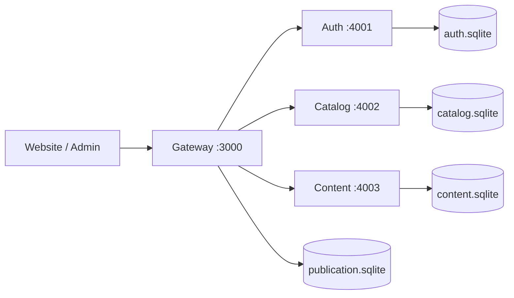

# Arsitektur CMS

GitHub Pages memakai localStorage melalui `web/data.js`. Backend memakai request same-origin `/api`. Gateway mengganti respons `web/config.js` untuk memilih mode API. Kedua mode memakai seed dan validator yang sama.

## Tabel dan relasi

| Database | Tabel | Kolom utama / relasi |
| --- | --- | --- |
| Auth | users | id PK, email UNIQUE, password_hash, salt, role, created_at |
| Auth | sessions | token_hash PK, user_id FK → users, expires_at |
| Catalog | collections | id PK, name, description |
| Catalog | products | id PK, collectionId FK → collections, name, colorName, color, price, stock, status, model, product |
| Catalog | hijabs | id PK, collection, color, name, price, stock, image |
| Content | hero | id PK singleton, media |
| Content | banner | id PK singleton, enabled, title, subtitle, mediaType, media |
| Content | slides | id PK, caption, mediaType, media |
| Publication | site_releases | id PK, document JSON, published_by, created_at |

Setiap database juga memiliki tabel `migrations` untuk inisialisasi idempotent. Tidak ada foreign key antar database. Snapshot publik terpisah dari tabel draf. `stock=0` menampilkan sold out. Harga berupa integer rupiah. `status=published` berarti produk disertakan saat tombol Publikasikan ditekan; Simpan tetap mengubah draf saja.

## API gateway

Mutasi memerlukan `Content-Type: application/json`. Endpoint admin memerlukan cookie sesi. Error berbentuk `{ "error": "pesan" }`.

| Method | Endpoint | Fungsi |
| --- | --- | --- |
| GET | /api/health | Cek layanan |
| GET | /api/storefront | Snapshot publik |
| POST | /api/auth/login | Body email/password; cookie 8 jam |
| GET | /api/auth/session | Akun aktif |
| POST | /api/auth/logout | Cabut sesi |
| GET | /api/admin/state | Data draf gabungan |
| POST | /api/admin/products | Tambah produk |
| PUT / DELETE | /api/admin/products/:id | Edit / hapus produk |
| POST | /api/admin/collections | Tambah koleksi |
| PUT / DELETE | /api/admin/collections/:id | Edit / hapus koleksi kosong |
| PUT | /api/admin/hijabs/:id | Edit hijab bawaan |
| PUT | /api/admin/hero | Edit video utama |
| PUT | /api/admin/banner | Edit banner |
| POST | /api/admin/slides | Tambah lookbook |
| PUT / DELETE | /api/admin/slides/:id | Edit / hapus lookbook |
| POST | /api/admin/publish | Publikasikan snapshot |

Koleksi baru muncul di beranda dan halaman semua produk. Menu kategori editorial tetap memakai kategori TANJ bawaan. CMS ini belum mencakup pelanggan, pembayaran, pengurangan stok otomatis, upload object storage, multi-role, reset password via email, dan audit per-field. Rate limit login memakai alamat koneksi gateway; pengguna reverse proxy berbagi batas sampai dukungan trusted proxy/IP ditambahkan.
